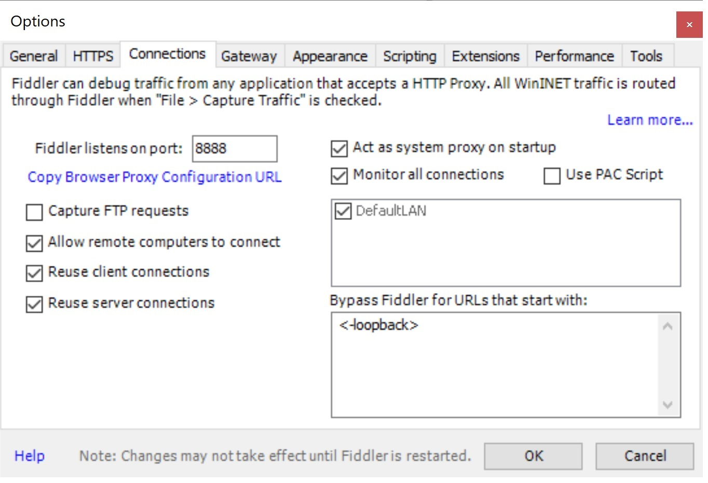
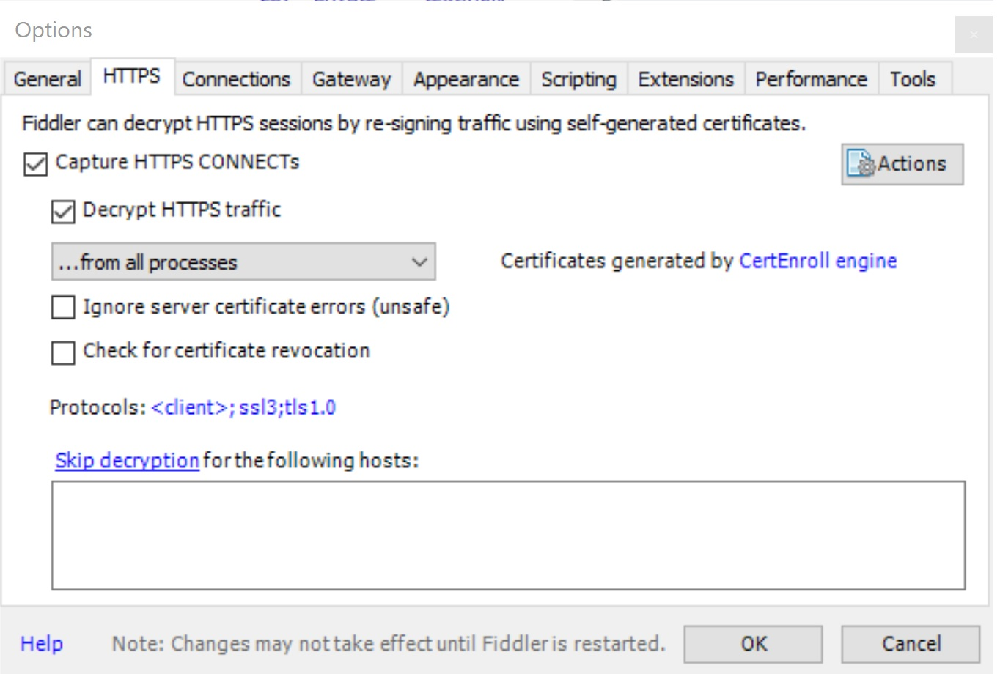

# Roku-Fiddler-Example #
## Step by step on how to configure Fiddler and a development Roku to examine Roku network traffic ##

As the developer for the lastest [SomaFM](https://channelstore.roku.com/details/35082ffbffa265fefd5c7a8e2c84f875/somafm) app on the Roku platform I had the need to examine and control the network traffic to and from the Roku device I was using for development. 

To do this I needed to stand up a network proxy and direct the Roku network traffic to it. My choice of proxy was [Fiddler Classic](https://www.telerik.com/download/fiddler) from Telerik. I chose to use Fiddler, since I was familiar with it and I was going to use a Windows to host the proxy. In my case I installed Fiddler on a VM on my network but you can install it locally if needed. I chose to host Fiddler on a separate system in order to better isolate network activity and configuration.

## Download and install Fiddler ## 
This is straightforward. Just run the FiddlerSetup.exe installer. During the installation you're prompted as to what language you want the rules file to be in. I chose ```C#```. The other option is ```Jscript.Net```. The Fiddler installer will add a rule in the Windows Defender Firewall to allow incoming connections.

## Configure Fiddler ##
Open Fiddler and go to Tools -> Options and selected the Connections tab. Check **Allow remote computers to connect**. This enables Fiddler to accept connections from the Roku. Note the port number used by Fiddler. The port number, along with the IP address of the proxy, will be used in your Roku channel code to redirect requests to the proxy.


## Add URL Rewrite Rule To Fiddler ##
Since the Roku is not proxy aware, you will need to modify how Fiddler processes requests from the Roku. This is done by editing the Fiddler Rules file. We need to make a change to the OnBeforeRequest method. Search for this in the rules file and add this code snippet to the end of the method.
```C#
    // Roku Proxy
    char[] splitchars = {';'};
    var parts = oSession.fullUrl.Split(splitchars, 2);
    if (parts.Length > 1)
    {
        oSession.fullUrl = parts[1];
    }
```
What this change does is examine the incoming request, if it finds a ```;``` delimter in the request string it will parse it into a two element array.The first element is the IP and port of the proxy, the second element of the array becomes the outgoing request. 

## Add Changes To The Roku Channel Code ##
In order for the proxy forwarding to work there needs to be some changes to the Roku channel code. Everywhere a ```roUrlTransfer``` object is being used to make network request we need to modify the request URL so that Fiddler can properly forward the request to the destination. This modificaion concatenates the IP address and port number of the proxy, the ```;``` character, and the original destination URL - ```<ProxyIP:port>;<URL>```. The following function can be used to create the request string in the proper format. Thanks and credit to [Chris Dwyer-Perkins](https://github.com/chrisdp/Roku-Charles-example) for creating this function.

``` basic
' Function to form URL request
' This allows using a proxy for the Roku for debugging purposes
function getUrlProxy(url as string)
#if PROXY
    if left(url, 4) <> "http" then return url
    ' This address is <HOST_RUNNING_FIDDLER>:<FIDDLER_PORT>;<ORIGINAL_ADDRESS>
    proxyAddress = "192.168.1.50:8888"

    ' Make sure we have not already formatted this url
    ' This can lead to a recursive address
    if not url.inStr(proxyAddress) > -1 then
        if url <> invalid and proxyAddress <> invalid
            proxyPrefix = "http://" + proxyAddress + "/;"
            currentUrl = url

            ' Double check again. You really don't want a recursive address
            if currentUrl.inStr(proxyPrefix) = 0 then
            return url
            end if

            ' Combine the addresses together resulting in the following format:
            ' <HOST_RUNNING_FIDDLER>:<FIDDLER_PORT>;<ORIGINAL_ADDRESS>
            proxyUrl = proxyPrefix + currentUrl
            return proxyUrl
        end if
    end if
#end if
    return url
end function
```
## Decrypting HTTPS ##
To decrypt HTTPS go to Tool -> Options -> HTTPS and check **Decrypt HTTPS traffic**. This will installed self signed certificate to handle decrypting.



## Start Debugging! ##
After following the above recommendations and changes, make sure Fiddler is up and running and start your Roku channel. You should then see network traffic from the Roku appear in the Fiddler log.

Charles is another proxy that can be used in Roku development. Here's a link to an example on how to use Charles. 
https://github.com/chrisdp/Roku-Charles-example

